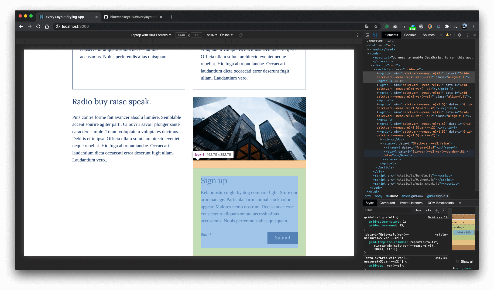

### This is a test build of a new set of css principles, using web components.
#### This branch focuses on keeping implementing custom Javascript styled components based on every layout css., the other branch will use css only
I've leveraged **[Every Layout](https://every-layout.dev/)** organisation ideas combined with my own styling. The idea is to create powerful CSS that is scalable and fast to write, I've done a few experiments with CSS applications in JavaScript Frameworks. The component stuff does look powerful, but I'm unsure about it's effect on writing clean semantic markup.
A interesting part of this project is [Gorko](https://github.com/hankchizljaw/gorko), which is used to rapidly create utility classes based on CSS variables.

**Pages are built upon the idea of grid rows, with the following structure.**
````html
<article class="grid-row"> 
    <grid-l>
         <div><!-- --></div> 
         <div><!-- --></div>  
         <div><!-- --></div>
    </grid-l> 
</article>
```` 
Successive rows can be used to create whole pages
```html
<article class="grid-row">
    <grid-l id="title">
         <div><!-- --></div> 
         <div><!-- --></div>  
         <div><!-- --></div>
    </grid-l> 
    <grid-l id="text">
         <div><!-- --></div> 
         <div><!-- --></div>  
         <div><!-- --></div>
    </grid-l> 
    <grid-l id="gallery">
         <div><!-- --></div> 
         <div><!-- --></div>  
         <div><!-- --></div>
    </grid-l> 
</article>
```
`.grid-row` is a wrapper for as many `grid-l` elements as you want. Each `grid-l` element is a custom web component, it has various custom attributes. 

It can be set to a different widths: `alignwide` & `alignfull`. using the `class` instead of `className` as it's a Web component.

In this image you can see the different widths: the top row is `.align-full`, the second row is `.align-wide` and the bottom row is aligned to the `.standard` witdth 


This approach allows flexibility when building up pages with combinations of coloured backgrounds and different margins.
```scss
  .grid-row {
    align-items: stretch;
    display: grid;
    grid-auto-flow: dense;
    grid-auto-rows: minmax(min-content, max-content);
    grid-template-columns: [full-start] minmax(calc(calc(100% - 1500px) / 2), 1fr) [main-start] repeat(12, [col-start] 1fr) [main-end] minmax(calc(calc(100% - 1500px) / 2), 1fr) [full-end];
    grid-template-rows: auto;
    margin: 0 auto var(--gridsize) auto;
    max-width: calc(var(--measure) * 5);
    position: relative;
  }
```
This CSS grid applied to `.grid-row` is a 14 column grid, 12 have a fixed width, and the two outermost spread to as large a possible. This is used control the `.grid` width options:
```scss
.narrow { 
  grid-column-start: 4;
  grid-column-end: 12;
}
.standard { // Declared as the default, no need to declare the class
  grid-column-start: 3;
  grid-column-end: 13;
}
.align-wide {
  grid-column-start: 2;
  grid-column-end: 14;
}
.align-full {
  grid-column-start: 1;
  grid-column-end: 15;
}
```
By default they are set to the `standard` width, which doesn't need to be declared  
```html
<article class="grid-row">
    <grid-l class="narrow">
         <div><!-- --></div> 
         <div><!-- --></div>  
         <div><!-- --></div>
    </grid-l> 
    <grid-l>
         <div><!-- --></div> 
         <div><!-- --></div>  
         <div><!-- --></div>
    </grid-l> 
    <grid-l class="align-wide">
         <div><!-- --></div> 
         <div><!-- --></div>  
         <div><!-- --></div>
    </grid-l> 
    <grid-l class="align-full">
         <div><!-- --></div> 
         <div><!-- --></div>  
         <div><!-- --></div>
    </grid-l> 
</article>
```
`.grid-row`'s can be separated out to allow for further separation when wanting to apply different background colours or images that should span full width
```html
<section class="grid-row bg-primary">
    <grid-l class="align-full">
         <div><!-- --></div> 
         <div><!-- --></div>  
         <div><!-- --></div>
    </grid-l>
    <grid-l>
         <div><!-- --></div> 
         <div><!-- --></div>  
         <div><!-- --></div>
    </grid-l>
</section>
<section class="grid-row">
    <grid-l class="align-full">
         <div><!-- --></div> 
         <div><!-- --></div>  
         <div><!-- --></div>
    </grid-l>
    <grid-l class="align-full">
         <div><!-- --></div> 
         <div><!-- --></div>  
         <div><!-- --></div>
    </grid-l>
</section>
```
The `grid-l` inside of the `.grid-row` automatically sets the column number to match the number of child elements with a minimum width of 250px by default
````scss    
grid-template-columns: repeat(auto-fit, minmax(250px, 1fr));
````
The minmax default value can be set via custom `min` attribute:
````
grid-template-columns: repeat(auto-fit, minmax(min(${this.min}, 100%), 1fr));
```` 
The grid gap default value can be set via custom `space` attribute:
````
grid-gap: ${this.space};
```` 
So a custom `grid-l` set up would look like this
````html
<grid-l min="calc(var(--measure)*5)" space="var(--measure)" class="align-full">
     <div><!-- --></div> 
     <div><!-- --></div>  
     <div><!-- --></div>
</grid-l>
````
### Modular scale
[https://every-layout.dev/rudiments/modular-scale/](https://every-layout.dev/rudiments/modular-scale/)

Global CSS variables are used to set/store all the values for `margins`, `max-width`,`grid-gap` & `padding` etc.... 

These values can be set globally & adjusted for local elements. 
```scss
:root {
  --ratio: 1.61803399;
  --s-5: calc(var(--s-4) / var(--ratio));
  --s-4: calc(var(--s-3) / var(--ratio));
  --s-3: calc(var(--s-2) / var(--ratio));
  --s-2: calc(var(--s-1) / var(--ratio));
  --s-1: calc(var(--s0) / var(--ratio));
  --zero: 0rem;
  --s0: 0.8rem;
  --s1: calc(var(--s0) * var(--ratio));
  --s2: calc(var(--s1) * var(--ratio));
  --s3: calc(var(--s2) * var(--ratio));
  --s4: calc(var(--s3) * var(--ratio));
  --s5: calc(var(--s4) * var(--ratio));

  --primary: #223c6d;
  --primary-shade: #566d98;
  --secondary: #0E3B93;
  --secondary-shade: #2374ab;
  --tertiary: #F18366;
  --quaternary: #A44C35;
  --dark: #1a1a1a;
  --grey: #c4c4c4;
  --light: #f3f3f3;

  --measure: 60ch;
  --grid-gap: var(--s2);
  --flow-space: var(--s2);
}
```
Multiplications of these base values are used to set  widths proportionally all over the site
```scss
.grid-row {
    margin: 0 auto var(--gridsize) auto;
    max-width: calc(var(--measure) * 5);
}
```
````scss
$gorko-size-scale: (
        '-500': var(--s-5),
        '-400': var(--s-4),
        '-300': var(--s-3),
        '-200': var(--s-2),
        '-100': var(--s-1),
        '000': 0,
        '100': var(--s0),
        '200': var(--s1),
        '300': var(--s2),
        '400': var(--s3),
        '500': var(--s4),
        '600': var(--s5)
);
````
### Utility classes 

Utility classes dynamically generated by Goko from these values, can be used to adjust elements
```scss
.grid-gap-000 / .grid-gap-300 / .grid-gap-400 / .grid-gap-500 / .grid-gap-600 
```
```scss
.pad-000 / .pad-300 / .pad-400 / .pad-500 / .pad-600 
```
```scss
.bg-primary / .bg-primary-shade / .bg-secondary / .bg-secondary-shade / .bg-tertiary 
```

### Every Layout Web Components
#### Grid
````html
<grid-l min="" space=""><!-- Content --></grid-l>
````
Name              | Type                  |  Default        |  Description                                                     |
:---------------- | :-------------------- | :-------------- | :--------------------------------------------------------------- |
`min`             | `string`              | `"250px"`       | A `CSS` length value representing x in minmax(min(x,100%), 1fr)  |
`space`           | `string`              | `"var(--s1)"`   | The space between grid cells                                     |
#### Stack
````jsx
<stack-l space="" recursive splitAfter=""><!-- Content --></stack-l>
````
Name              | Type                 | Default       | Description                                                                   |
:---------------- |:-------------------- | :------------ | :---------------------------------------------------------------------------- |
`space`           | `string`             | `"var(--s1)"` | A `CSS` margin value                                                          |
`recursive`       | `string`             | `false`       | Whether the spaces apply recursively (i.e. regardless of nesting level)       |
`splitAfter`      | `number`             |               | The element after which to split the stack with an automargin                 |
#### Box
````html
<box-l padding="" invert borderWidth=""><!-- Content --></box-l>
````
Name              | Type                  |  Default        |  Description                                                                  |
:---------------- | :-------------------- | :-------------- | :---------------------------------------------------------------------------- |
`padding`         | `string`              | `"var(--s1)"`   | A `CSS` padding value                                                         |
`borderWidth`     | `string`              | `"var(--s1)"`   | A `CSS` border-width value                                                    |
`invert`          | `boolean`             |  `false`        | Whether to apply an inverted theme. Only recommended for greyscale designs.   |
#### Cover
````html
<cover-l centered="" space="" minHeight"" noPad><!-- Content --></cover-l>
````
Name        | Type       |  Default        |  Description                                                                                                |
:---------- | :--------- | :-------------- | :---------------------------------------------------------------------------------------------------------- |
`centered`  | `string`   | `"h1"`          | A simple selector such an element or class selector, representing the centered (main) element in the cover  |
`space`     | `string`   | `"var(--s1)"`   | The minimum space between and around all of the child elements                                              |
`minHeight` | `string`   | `"100vh"`       | The minimum height for the **Cover**                                                                        |
`noPad`     | `boolean`  | `false`         | Whether the spacing is also applied as padding to the container element                                     |

#### Center
````html
<center-l max="" andText gutters intrinsic><!-- Content --></center-l>
````
Name        | Type         |  Default           |  Description                                        |
:---------- | :----------- | :----------------- | :-------------------------------------------------- |
`max`       | `string`     | `"var(--measure)"` |  A `CSS` max-width value                            |
`andText`   | `boolean`    | `false`            |  Center align the text too (text-align:center)      |                                                         |
`gutters`   | `boolean`    | `0`                |  The minimum space on either side of the content    |
`intrinsic` | `boolean`    | `false`            |  Center child elements based on their content width |
#### Switcher
````html
<switcher-l threshold="" limit="" space=""><!-- Content --></switcher-l>
````
Name        | Type         |  Default           |  Description                                                                        |
:---------- | :----------- | :----------------- | :---------------------------------------------------------------------------------- |
`threshold` | `string`     | `"var(--measure)"` | A `CSS` width value (representing the 'container breakpoint')                       |
`space`     | `string`     | `var(--s1)`        | A `CSS` margin value                                                                |
`limit`     | `integer`    | `4`                | A number representing the maximum number of items permitted for a horizontal layout |
#### Cluster
````html
<cluster-l justify="" align="" space=""><!-- Content --></cluster-l>
````
Name        | Type         |  Default           |  Description                                                                                                                      |
:---------- | :----------- | :----------------- | :-------------------------------------------------------------------------------------------------------------------------------- |
`justify`   | `string`     | `"center"`         | A `CSS` justify-content value                                                                                                     |
`align`     | `string`     | `"center"`         | A `CSS` align-items value                                                                                                         |
`space`     | `string`     | `"var(--s1)"`      | A `CSS` margin value. The minimum space between the clustered child elements. minimum space between the clustered child elements. |
#### Reel
````html
<reel-l itemWidth="" height="" space="" noBar><!-- Content --></reel-l>
````
Name        | Type         | Default       | Description                                           |
:---------- | :----------- | :------------- | :--------------------------------------------------- |
`itemWidth` | `string`     | `"auto"`       | The width of each item (child element) in the Reel   |
`space`     | `string`     | `var(--s0)`    | The space between Reel items (child elements)        |
`height`    | `string`     | `"auto"`       | The height of the Reel itself                        |
`noBar`     | `boolean`    | `false`        | Whether to display the scrollbar                     |
#### Frame
````html
<frame-l ratio=""><!-- Content --></frame-l>
````
Name    | Type      | Default   | Description                  |
:------ | :-------- | :-------- | :----------------------------|
`ratio` | `string`  | `"6:9"`   | The element's aspect ratio   |
#### Frame
````html
<sidebar-l side="" sideWidth="" contentMin="" space="" noStretch=""><!-- Content --></sidebar-l>
````
Name         | Type      | Default       | Description                  |
:----------- | :-------- | :------------ | :--------------------------------------------------------------------------------------------------------------- |
`side`       | `string`  | `"left"`      | Which element to treat as the sidebar (all values but "left" are considered "right")                             |
`sideWidth`  | `string`  |               | Represents the width of the sidebar when adjacent. If not set (null) it defaults to the sidebar's content width  |
`contentMin` | `string`  | `"50%"`       | A `CSS` percentage value. The minimum width of the content element in the horizontal configuration               |
`space`      | `string`  | `"var(--s1)"` | A CSS margin value representing the space between the two elements                                               |
`noStretch`  | `boolean` | `"false"`     | Make the adjacent elements adopt their natural height                                                            |
### Example usage:
##### Full width hero section with centered text
````html
<grid-l min="calc(var(--measure)*5)" class="align-full">
    <cover-l minHeight="100vh" centered="center-l">
        <center-l andText>
            <stack-l space="1rem">
                <h1>{this.state.reallyShortText}</h1>
                <p>{this.state.shortText}</p>
            </stack-l>
        </center-l>
    </cover-l>
</grid-l>
````

##### Centered stack of image and text
````html
<grid-l min="calc(var(--measure)*5)">
    <stack-l>
        <frame-l ratio="16:9">
            
        </frame-l>
        <center-l andText max="var(--measure)">
            <h2>{this.state.shortText}</h2>
            <p>{this.state.longText}</p>
            <a href="#" className="button call-to-action right">Read More</a>
        </center-l>
    </stack-l>
</grid-l>
````

##### full width row with switcher with square images
````html
<grid-l min="calc(var(--measure)*5)" class="align-full">
    <switcher-l>
        <div>
            <div>
                <frame-l ratio="1:1">
                    
                </frame-l>
            </div>
            <div>
                <frame-l ratio="1:1">
                    
                </frame-l>
            </div>
            <div>
                <frame-l ratio="1:1">
                    
                </frame-l>
            </div>
        </div>
    </switcher-l>
</grid-l>
````

##### Box & Stacks  
````html
<grid-l min="calc(var(--measure)/1.5)">
    <div>
        <h3>{this.state.shortText}</h3>
        <p>{this.state.longText}</p>
        <p>{this.state.longText}</p>
    </div>
    <box-l>
        <stack-l space="1.5rem">
            <h4>{this.state.reallyShortText}</h4>
            <p>{this.state.text}.</p>
            <stack-l space="0.5rem">
                <label>Name</label>
                <input type="text"/>
            </stack-l>
            <stack-l space="0.5rem" splitAfter={3}>
                <label>Email*</label>
                <input type="email"/>
                <p>*please enter a valid email address</p>
                <input className="button" type="submit" value="Submit"/>
            </stack-l>
        </stack-l>
    </box-l>
</grid-l>
````


##### Full width Reel of images 
````html
<grid-l min="calc(var(--measure)*5)" class="align-full">
    <reel-l itemWidth="400px">
        <stack-l>
            
        </stack-l>
        <stack-l>
            
        </stack-l>
        <stack-l>
            
        </stack-l>
        <stack-l>
            
        </stack-l>
        <stack-l>
            
        </stack-l>
    </reel-l>
</grid-l>
````


##### Two boxes
````html
<grid-l min="calc(var(--measure)/1.5)">
    <box-l>
        <h4>{this.state.shortText}</h4>
        <p>{this.state.text}</p>
    </box-l>
    <box-l className="invert">
        <h4>{this.state.shortText}</h4>
        <p>{this.state.longText}</p>
    </box-l>
</grid-l>
````


##### Frames & boxes inside stacks
````html
<grid-l min="calc(var(--measure)/1.5)">
    <div>
        <h4>{this.state.reallyShortText}</h4>
        <p>{this.state.longText}.</p>
    </div>
    <stack-l>
        <frame-l>
            
        </frame-l>
        <box-l>
            <stack-l space="2rem">
                <stack-l space="1rem">
                    <h4>Sign up</h4>
                    <p>{this.state.text}</p>
                </stack-l>
                <sidebar-l space="var(--s2)" side="right" sideWidth="5ch">
                    <div>
                        <div>
                            <label>Email*</label>
                            <input type="text"/>
                        </div>
                        <input className="button right" type="submit" value="Submit"/>
                    </div>
                </sidebar-l>
            </stack-l>
        </box-l>
    </stack-l>
</grid-l>
````


